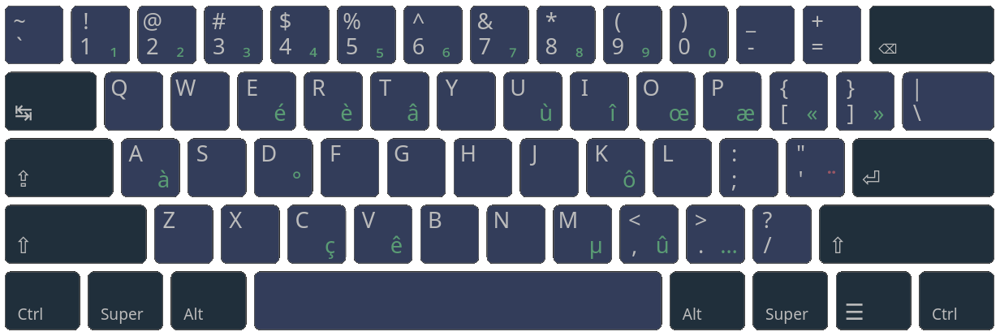

# Charachorder French
A french QWERTY layout for the Charachorder One

**Work in progress**

## Installation
This is a Kalamine definition file.
Just use Kalamine, XKalamine, on WKalamine to install it.

Official Kalamine repository:
[https://github.com/OneDeadKey/kalamine](https://github.com/OneDeadKey/kalamine)

## Setup
locale      = "fr"
variant     = "charachorder"
